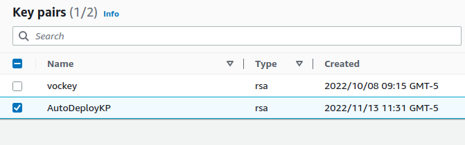
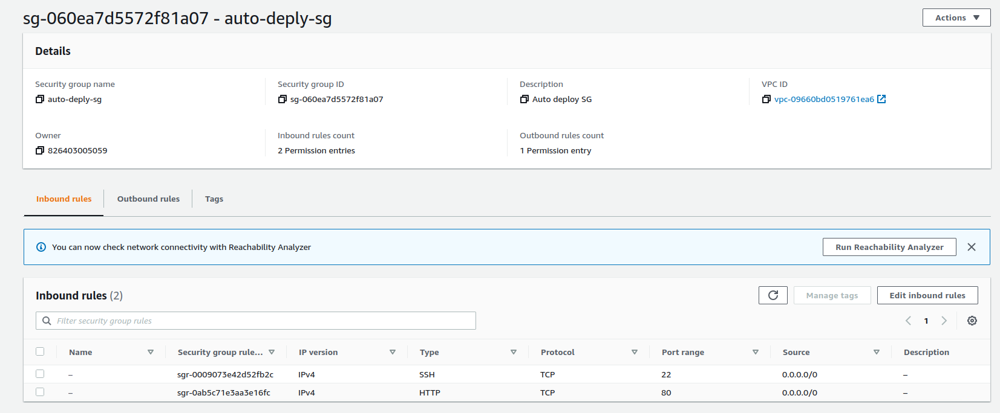
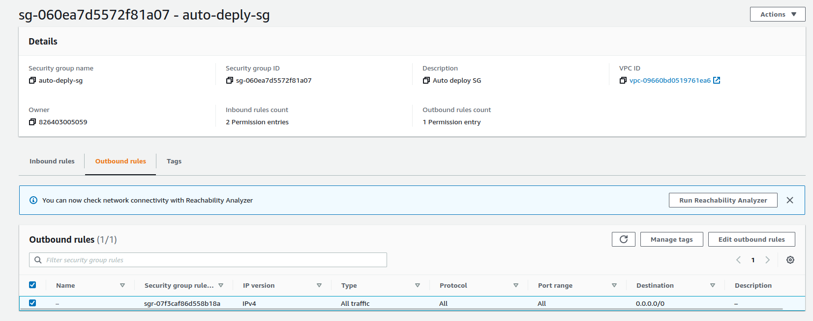
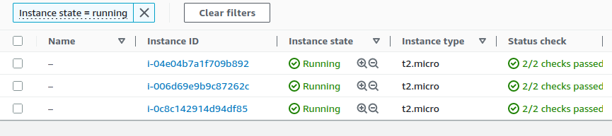
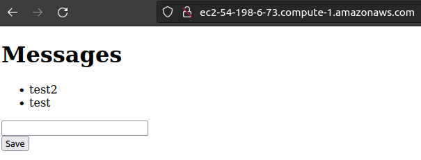

# automatic-deploy

Trabajo realizado por Daniel Vela

## Scripts

Este trabajo consta de 4 scripts distintos: `setup.sh`, `deploy.sh` `terminate.sh` `clean-aws.sh`.

`setup.sh` es el script que genera el keypair a utilizar y el grupo de seguridad para todas las instancias. Adicionalmente, genera los archivos de configuración `sg.txt`, `vpc.txt` y `subnet.txt` en la carpeta `config`, los cuales son necesarios para la creación de instancias.

`deploy.sh` es el script que crea 3 instancias de EC2, las configura y despliega la aplicación en cada una de ellas. Esta aplicación está disponible [aquí](https://github.com/develalopez/intro-workshop-aygo). Adicionalmente, este script genera los archivos de configuración `inst{n}id.txt` y `inst{n}dns.txt` (siendo `n` 1, 2 o 3) dentro de la carpeta `config/instances`, los cuales son necesarios para la configuración de las instancias y el despliegue de la aplicación.

`terminate.sh` es el script que elimina las instancias de EC2 y los archivos de configuración relacionados.

`clean-aws.sh` es el script que elimina el grupo de seguridad y el par de llaves de las instancias para terminar de limpiar los recursos de la cuenta, además de el resto de archivos de configuración relacionados. Es importante ejecutar `terminate.sh` y esperar a que las instancias sean totalmente eliminadas para no generar problemas al momento de eliminar el grupo de seguridad.

## Resultados

### Par de llaves

### Grupo de seguridad

### Instancias

### Aplicación

